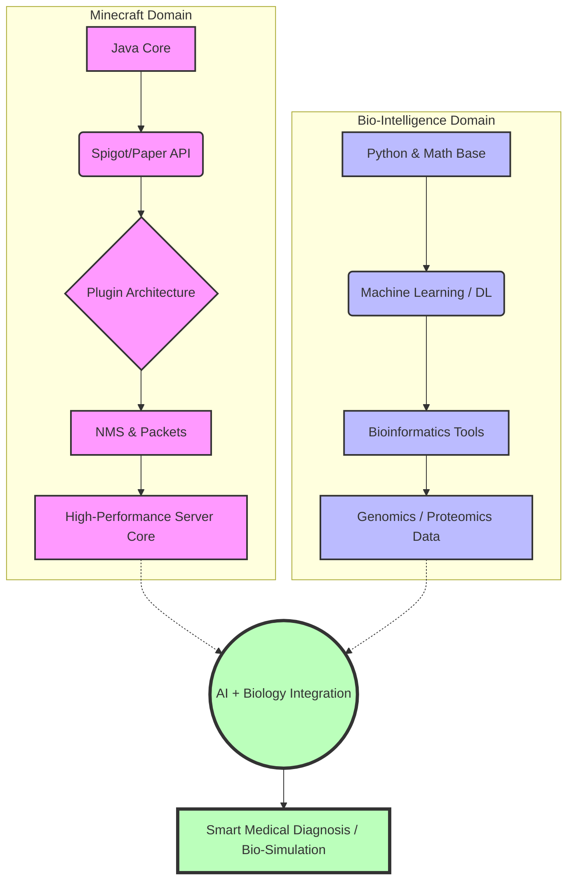

  
  
   

  > **"我是生活的细胞，不是机械的电路"** > _I code the blocky worlds, and explore the secrets of life._

   

  
  
  

---

### 🧬 关于我 (About Me)

你好！我是 **XiNian**。我是一名游走在虚拟方块世界与现实生物科学之间的开发者。

* 🔨 **Java Spigot Artisan:** 我拥有丰富的 Minecraft 服务端插件开发经验，专注于构建高性能、趣味性的游戏功能。
* 🧪 **AI & Bio-Med Explorer:** 我正在将技能栈拓展至人工智能领域，致力于探索 **AI + 生物学/医学** 的交叉应用（如蛋白质结构预测、医学影像分析等）。

---

### 🛠️ 技术军火库 (Tech Arsenal)

| **Minecraft Development** | **AI & Data Science (Loading...)** | **Infrastructure & Tools** |
|:---:|:---:|:---:|
|  |  |  |
|  |  |  |
|  |  |  |
|  |  |  |

---

### 🧩 插件工坊 (Spigot/Paper Plugins)

我的仓库里存放了大量的 Minecraft 插件，旨在优化服务器体验与玩法。

| 📦 项目名称 | 📝 简介 | 🔧 技术栈 |
|:--- |:--- |:--- |
| **FuckUHFS** | 校园成绩一键解析系统，让查分更简单。 | `Java` `Jsoup` |
| **[你的插件名1]** | [这里写你的插件简介，例如：自定义RPG物品系统] | `Spigot API` `NMS` |
| **[你的插件名2]** | [这里写你的插件简介，例如：服务器性能优化工具] | `Paper API` `Async` |
| **更多插件...** | 查看我的仓库获取更多开源作品！ | `Java` |

---

### 🗺️ 进化路线 (Evolution Roadmap)

这是我目前的技能树点亮计划，从构建虚拟世界走向解码生命本质。

### 📊 代码统计 (Coding Stats)

   

  

 <i>Let's build the future, one block (and one cell) at a time.</i> 

